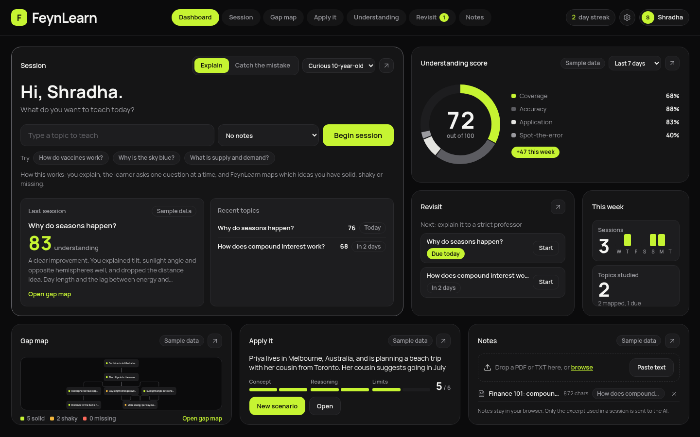
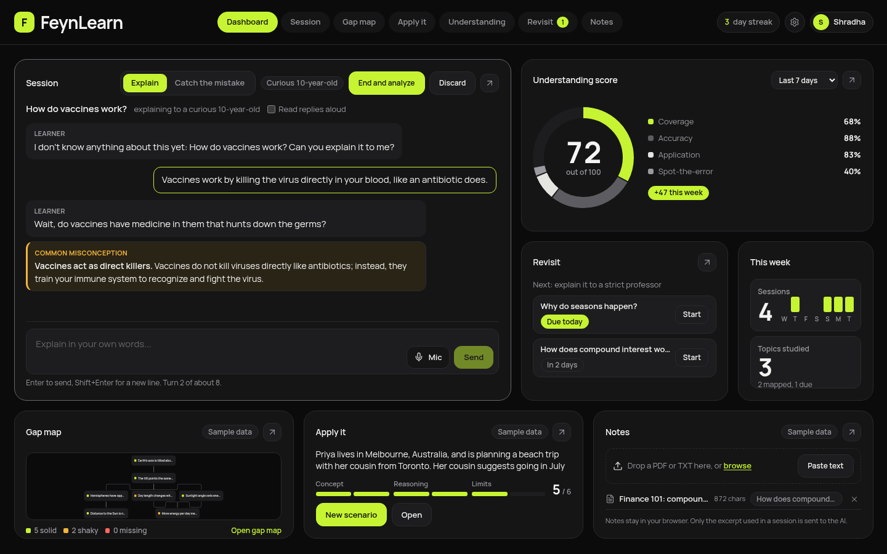
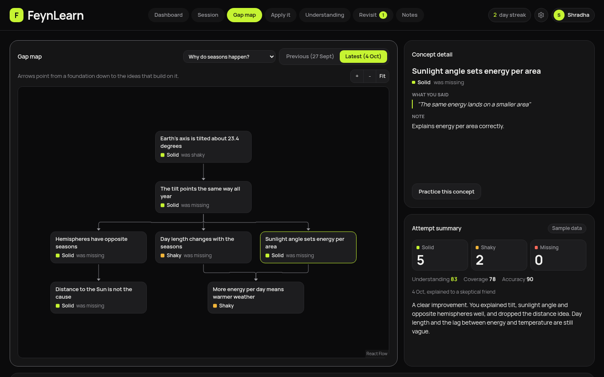
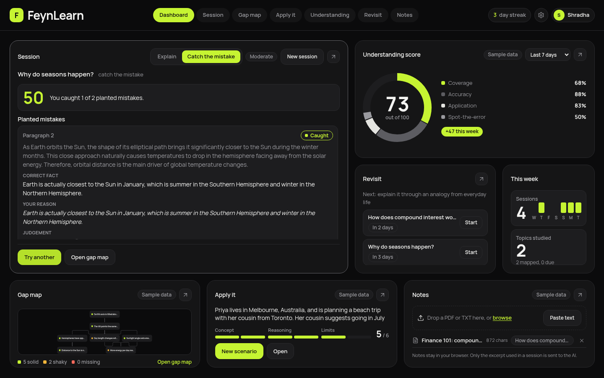
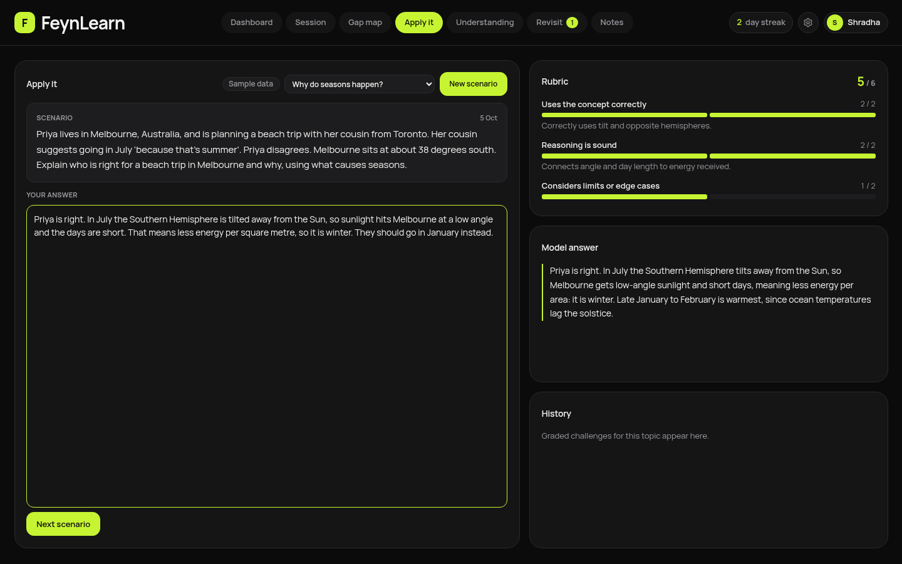
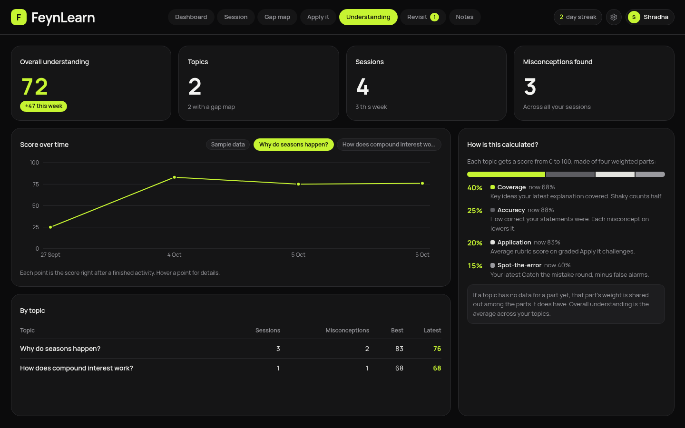
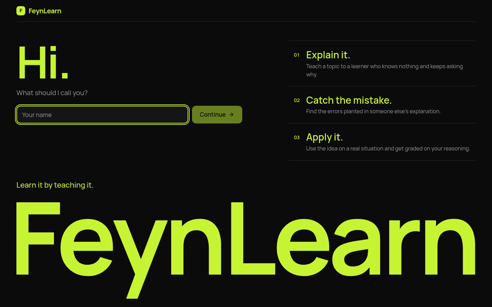
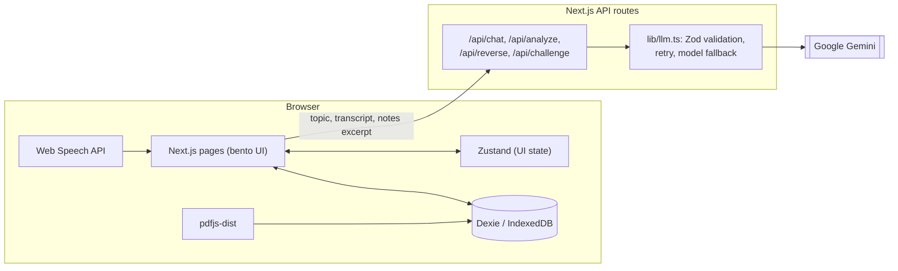

# FeynLearn

**Learn it by teaching it.** FeynLearn makes you explain a topic to an AI learner who knows nothing, then shows
exactly which ideas you have solid, shaky or missing, and makes you catch mistakes and apply the idea to real
situations.

**Track:** AI + Education (ForgeHacks, "AI for Real World Problems")
**Live demo:** _add the Vercel link here_
**Demo video:** _add the video link here_



## The problem

Most studying is recognition: rereading notes, highlighting, flashcards. It feels like learning, but it breaks
down the moment you have to explain *why* something happens or use it in a new situation. Students find this out
in the exam, not before.

**Who it is for**

- Students who can recite definitions but cannot explain them.
- Self-learners with no teacher to question them.
- Anyone preparing for an exam or interview who needs to know where their understanding actually has gaps.

## The solution

The Feynman technique says you understand something when you can explain it simply to someone else. FeynLearn
turns that into a loop:

1. **Explain** the topic to a learner persona that asks one probing question at a time and flags misconceptions.
2. **See the gaps** on a concept map built from your own words, with a quote as evidence for every node.
3. **Catch the mistake** in an explanation with errors planted where students usually go wrong.
4. **Apply it** to a concrete scenario and get graded on reasoning, not recall.
5. **Revisit** on a spaced schedule, each time from a different angle.

| | |
| --- | --- |
|  |  |
| Explain mode: the learner probes, and wrong statements get a "Common misconception" callout. | Gap map: concepts marked solid, shaky or missing, compared with your previous attempt. |
|  |  |
| Catch the mistake: flag the planted errors, then see what you caught and missed. | Apply it: a realistic scenario, a 3-criterion rubric and a model answer. |
|  |  |
| Understanding: score over time and how it is calculated. | Welcome screen. |

More: [Revisit](docs/screenshots/06-revisit.png), [Notes](docs/screenshots/07-notes.png),
[dashboard on a phone](docs/screenshots/10-dashboard-mobile.png).

## Features, mapped to the track prompt

| Prompt | Feature | How it works |
| --- | --- | --- |
| **Understand concepts** | Feynman chat | Explain to a curious 10-year-old, a skeptical friend or a strict professor. One question per turn; jargon and hand-waving get challenged. Voice input and read-aloud where the browser supports them. |
| | Misconception flags | When you state something false, the reply comes with a one-sentence correction, and it is logged. |
| **Make connections** | Gap map | After a session, 5-8 key concepts with dependencies, each solid, shaky or missing with your own words as evidence. Toggle "previous vs latest" to watch red turn green. |
| | Revisit angles | SM-2-style spacing (1, 3, 7, 14, 30 days; a poor score resets). Each revisit rotates the angle: new persona, analogy, Apply it, Catch the mistake. |
| **Apply what they learn** | Apply it | A concrete scenario with names and numbers, graded 0-2 on using the concept, sound reasoning and limits, with a model answer after you submit. |
| | Catch the mistake | 1-3 plausible errors planted in an explanation (Obvious, Moderate, Subtle). You flag and justify; it reports caught, partly, missed and false alarms. |
| **Grounding** | Your notes | Upload a PDF or TXT, or paste text. Linked notes become the reference the AI judges you against. Notes never leave the browser; only a relevant excerpt is sent. |

## Technical approach

**Where AI is used.** Four API routes, each with a narrow job and a Zod schema for its output:

- **Conversational persona** (`/api/chat`): a learner who knows nothing and asks one short question per turn,
  returning `{ reply, misconception }` so the callout is structured data, not parsed text.
- **Structured analysis** (`/api/analyze`): grades the transcript into concepts with status, a verbatim
  quote or "not mentioned" as evidence, a note, and `dependsOn` edges for the graph.
- **Adversarial generation** (`/api/reverse`): writes an explanation with planted errors tied to common
  misconceptions, then judges the student's flags.
- **Rubric grading** (`/api/challenge`): writes a scenario, then scores the answer on three criteria and sketches a
  model answer.

**Prompt design.** Prompts live in `lib/prompts.ts`. The persona is told never to lecture or give answers, to
probe vague words, and to wrap up after about eight turns. The analysis must quote only the student, must keep
concept labels as true statements (errors go under misconceptions), and reuses concept ids from the previous
attempt so attempts can be compared node by node. Planted errors must be stated confidently, with no hints such as
"many people think".

**Reliability.** Every model response is validated with Zod and retried once if malformed. If the main model is
overloaded or rate limited, the call falls back to a lighter model. Things that should not depend on the model are
plain code with unit tests: coverage from concept statuses, "missed" verdicts and false alarms, the score formula,
the review scheduler, and cycle removal in the concept graph.

**Grounding in notes.** PDF text is extracted in the browser with pdfjs-dist. A note linked to a topic is split
into chunks, and the chunks sharing the most keywords with the topic (up to about 6,000 characters) go with each
request as the source of truth, never quoted back to the student.

**Privacy.** No accounts, no server database. Everything is stored in the browser with Dexie (IndexedDB); the
API key stays on the server.

### Architecture



More detail in [docs/architecture.md](docs/architecture.md).

### Understanding score

Each topic is scored 0-100: 40% concept coverage from the latest analysis, 25% accuracy (misconceptions lower it),
20% Apply it rubric average, 15% Catch the mistake. When a part has no data yet, its weight is shared among the
others. Overall understanding is the average across topics. See `lib/score.ts`.

## Real-world impact

FeynLearn targets the gap between "I have read it" and "I can explain and use it". Explaining surfaces gaps that
rereading hides; the gap map tells a learner exactly what to study next instead of rereading everything; catching
planted mistakes trains the critical reading that exams and real work need; and spaced revisits from new angles
fight the forgetting curve without repeating the same drill. It needs only a browser, works with a student's own
course notes, and costs nothing to run on free tiers.

## Limitations

- **The AI can be wrong.** Analyses and grades come from a language model and can misjudge an answer or miss an
  error. Linking good notes helps; the scores are a guide, not a grade.
- **Free-tier limits.** Gemini's free tier allows only a few requests per minute and models are sometimes
  overloaded. The app falls back to a second model and shows a "try again" message if both are unavailable.
- **Browser-only storage.** Data lives in one browser. Clearing site data or switching devices loses it (Settings
  has a JSON export).
- **Speech support.** Voice input needs a browser with speech recognition (Chrome, Edge, Safari) and microphone
  permission; the mic button is hidden otherwise.
- Scanned PDFs (images only) have no extractable text; paste the text instead.
- The rate limit is in memory and best-effort; it resets when a serverless function restarts.

## Run it locally

```bash
npm i
cp .env.example .env.local   # then add your key: GEMINI_API_KEY=...
npm run dev                  # http://localhost:3000
```

Get a free key at [Google AI Studio](https://aistudio.google.com/apikey). On first launch the app asks for your
name and loads sample data (two topics with history, a challenge and two notes), labeled "Sample data".

Other scripts: `npm run build`, `npm run lint`, `npm test` (Vitest: scheduler, score formula, concept graph,
dashboard maths, note excerpts, revisit angles).

| Variable | Required | Notes |
| --- | --- | --- |
| `GEMINI_API_KEY` | Yes | Server-side only. |
| `GEMINI_MODEL` | No | Main model, default `gemini-3.8-flash`. |
| `GEMINI_FALLBACK_MODEL` | No | Used when the main model is overloaded or rate limited, default `gemini-3.5-flash-lite`. |

## Tech stack

Next.js (App Router) and TypeScript, Tailwind CSS, Zustand, Dexie (IndexedDB), Vercel AI SDK with
`@ai-sdk/google` (Gemini), Zod, React Flow (`@xyflow/react`) with dagre, Recharts, pdfjs-dist, Web Speech API,
Vitest. Font: Manrope.

## Docs

- [docs/architecture.md](docs/architecture.md): diagram and request flow
- [docs/SUBMISSION.md](docs/SUBMISSION.md): submission text
- [docs/DEMO_SCRIPT.md](docs/DEMO_SCRIPT.md): 3-minute demo script
- [docs/DECISIONS.md](docs/DECISIONS.md): design and engineering decisions
- [BUILD_SPEC.md](BUILD_SPEC.md) and [UI_SPEC.md](UI_SPEC.md): the specs it was built from

