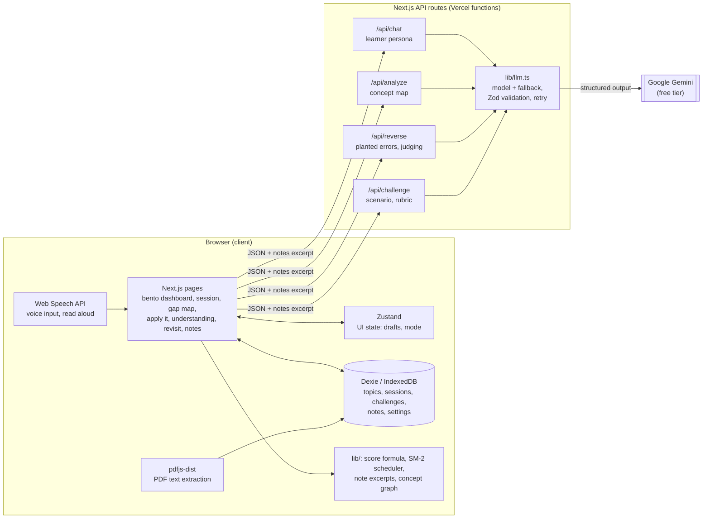

# FeynLearn architecture

FeynLearn is a Next.js app with no database and no login. Everything a learner creates lives in their
browser (IndexedDB). The only server code is four API routes that call Gemini, so the API key never
reaches the browser.

## Request flow

1. The page reads and writes everything through Dexie (`lib/db.ts`). Refreshing never loses work.
2. When a request needs the AI, the client sends only what that request needs: the topic, the transcript
   or paragraphs, and, if a note is linked to the topic, an excerpt of up to about 6,000 characters chosen by
   keyword overlap (`lib/notes.ts`).
3. Each route validates its body with Zod, caps input lengths, applies a best-effort per-IP rate limit and
   calls `generateStructured` in `lib/llm.ts`.
4. `generateStructured` asks Gemini for JSON matching a Zod schema (`lib/schemas.ts`), retries once if the
   output does not validate, and falls back from `gemini-3.8-flash` to `gemini-3.5-flash-lite` when the main
   model is overloaded or rate limited. Errors come back as `{ error }` with a message safe to show.
5. The client saves the result and recomputes the topic's understanding score (`lib/score.ts`) and its
   next review date (`lib/sm2.ts`) in `lib/progress.ts`.

## Where AI is used

| Route | Role of the model | Output (Zod-validated) |
| --- | --- | --- |
| `/api/chat` | Plays a learner (curious 10-year-old, skeptical friend or strict professor) who knows nothing and asks one short question per turn. Flags factually wrong statements. | `{ reply, misconception: null \| { name, correction } }` |
| `/api/analyze` | Grades the transcript into 5-8 key concepts, each solid, shaky or missing, with a verbatim quote as evidence and dependencies forming a graph. | concepts, misconceptions, summary, accuracy |
| `/api/reverse` | Writes an explanation with 1-3 planted, plausible errors; then judges the student's flags. | paragraphs with hidden `hasError`; verdicts and false alarms |
| `/api/challenge` | Writes a concrete real-world scenario; grades the answer on a 3-criterion rubric and sketches a model answer. | scenario; rubric (0-2 each) and model answer |

Deterministic parts stay in code, not in the model: coverage is computed from concept statuses, "missed"
verdicts and false alarms are decided on the server from the stored flags, the concept graph is cleaned of
cycles (`lib/graph.ts`), and scoring and scheduling are plain functions with unit tests.

## Files to start with

| Path | What it holds |
| --- | --- |
| `lib/llm.ts` | The only place that knows the provider and model |
| `lib/prompts.ts` | Every prompt |
| `lib/schemas.ts` | Request and response schemas |
| `lib/useExplain.ts`, `lib/useReverse.ts` | Session logic used by the Session box |
| `components/bento/` | Dashboard boxes |
| `components/sessionbox/` | The Session box (Explain, Catch the mistake) |
